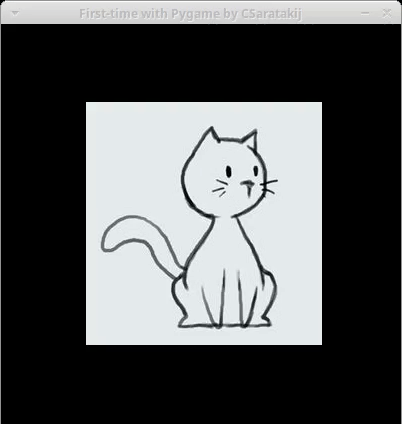

##First-Time-Pygame
my first time with a [pygame](http://www.pygame.org)

##Dependencies
- pygame 1.9.2
- python 3.5

##To run this app
`python main.py`

##Assets Credit
- [cat.jpg](https://s-media-cache-ak0.pinimg.com/236x/22/de/56/22de560882988177d06c1e5f3aa4c457.jpg)

##License
- [MIT](LICENSE.md)
